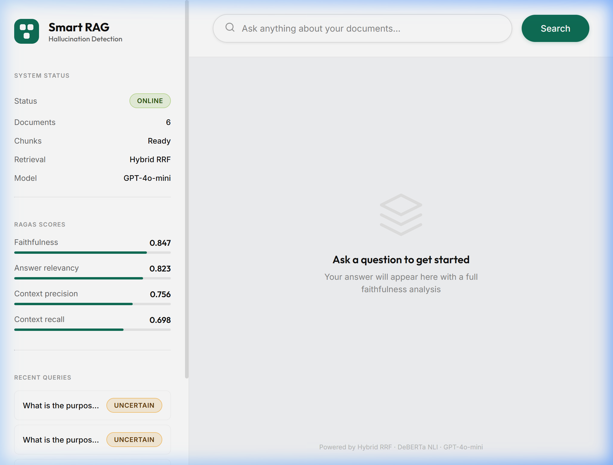
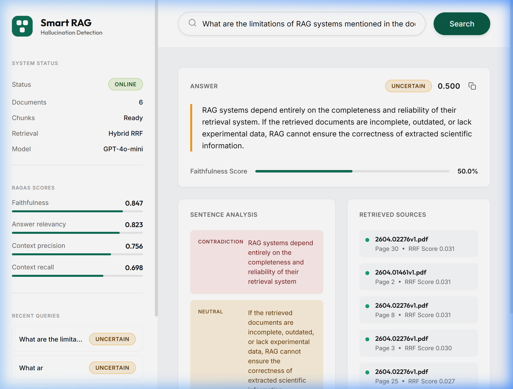
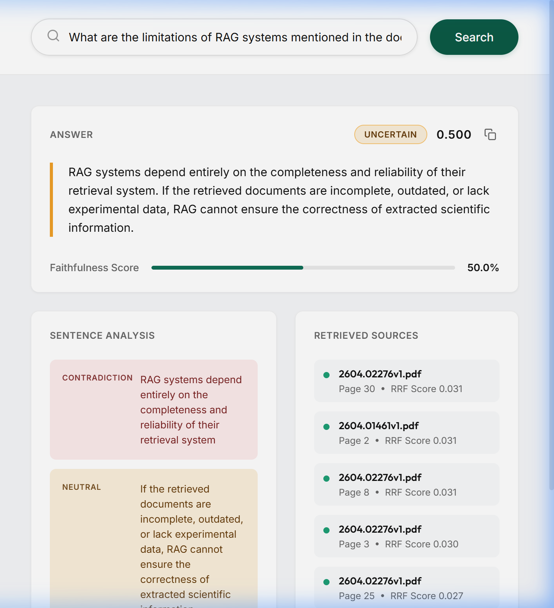
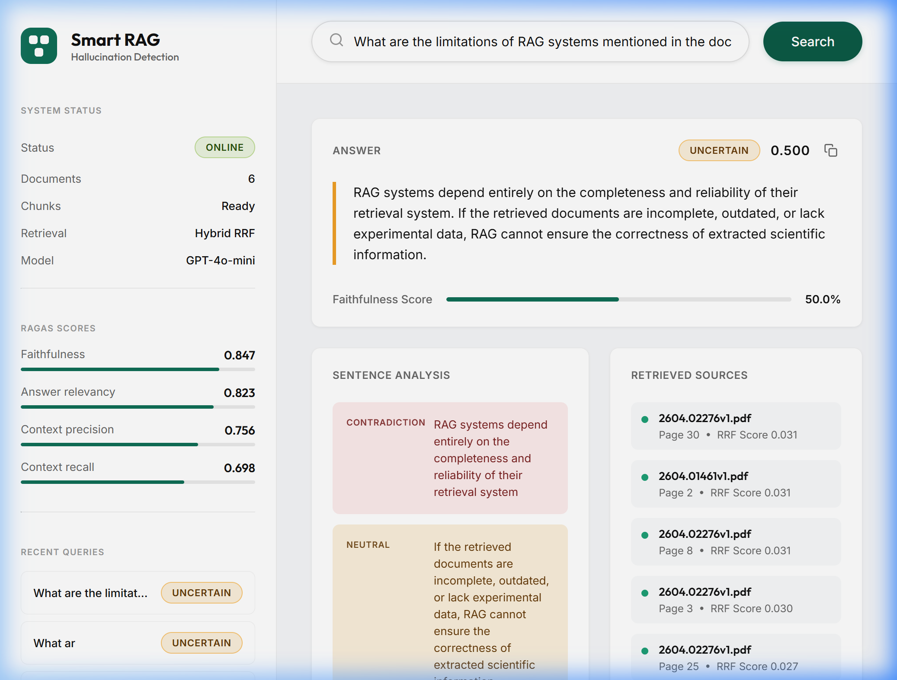
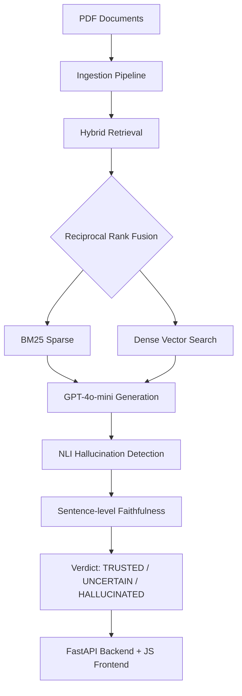

# Smart RAG System with Hallucination Detection

> An end-to-end Retrieval-Augmented Generation system with 
> NLI-based hallucination detection, hybrid retrieval, and 
> a production-quality web interface. Built using Google 
> Antigravity's multi-agent orchestration.

## 🌟 Visual Showcase

### Intelligent Dashboard
The Smart RAG dashboard features a modern, glassmorphic interface designed for clarity and ease of use. It provides real-time system status, RAGAS scores, and query history at a glance.



---

### Hallucination Detection in Action
When a query is executed, the system doesn't just provide an answer; it evaluates the **faithfulness** of the response. Every sentence is cross-referenced with retrieved context to detect hallucinations before they reach the user.



---

### Deep Semantic Analysis
The system provides a granular breakdown of the generated answer. Each sentence is labeled as **Entailment**, **Neutral**, or **Contradiction**, giving you full transparency into why a specific verdict was reached.



---

### Transparent Source Retrieval
See exactly which documents informed the answer. The system displays retrieved chunks with their **Reciprocal Rank Fusion (RRF)** scores, ensuring you can always verify information at the source.



---

## 📖 Overview

Most RAG systems retrieve documents and hope the LLM answers correctly. This system goes further — it detects when the model is hallucinating by scoring every generated sentence against the retrieved context using a Natural Language Inference (NLI) model, flagging answers that aren't grounded in the source documents.

## 🏗️ Architecture



## 🚀 Key Features

- **Hybrid Retrieval** combining BM25 keyword search and dense vector search using Reciprocal Rank Fusion — same approach used in production RAG systems.
- **NLI-based Hallucination Detection** using `deberta-v3-small` to score every sentence of the generated answer against retrieved context.
- **Sentence-level Breakdown** showing exactly which sentences are supported, neutral, or contradicted by source documents.
- **Real-time Faithfulness Score** displayed as a color-coded verdict with progress bar.
- **Result Logging** — every query logged to CSV with timestamp, score, verdict, and sentence counts.
- **Production-quality UI** built with pure HTML/CSS/JS, connected to a robust FastAPI backend.

## Tech Stack

| Component | Technology |
|-----------|------------|
| IDE & Agents | Google Antigravity (Gemini 3 Pro) |
| LLM | OpenAI GPT-4o-mini |
| Embeddings | sentence-transformers (all-MiniLM-L6-v2) |
| Vector Database | Qdrant (in-memory) |
| Sparse Retrieval | BM25 via rank-bm25 |
| Hallucination Detection | DeBERTa-v3 NLI model |
| Backend | FastAPI + Uvicorn |
| Frontend | Pure HTML / CSS / JavaScript |
| PDF Processing | PyMuPDF |
| Evaluation | RAGAS framework |

## Project Structure
```text
smart-rag-hallucination-detection/
├── ingestion/
│   ├── document_loader.py    # PDF loading with PyMuPDF
│   ├── chunker.py            # Overlapping text chunking
│   └── embedder.py           # Embedding + Qdrant storage
├── retrieval/
│   ├── bm25_retriever.py     # BM25 sparse retrieval
│   └── hybrid_retriever.py   # RRF fusion of BM25 + vector
├── generation/
│   └── generator.py          # GPT-4o-mini generation
├── evaluation/
│   ├── hallucination_detector.py  # NLI faithfulness scoring
│   ├── logger.py             # CSV result logging
│   ├── ragas_evaluator.py    # RAGAS benchmark evaluation
│   └── baseline_rag.py       # Baseline for comparison
├── static/
│   └── index.html            # Full frontend UI
├── data/
│   └── raw/                  # Place your PDFs here
├── main.py                   # Full pipeline runner
├── api.py                    # FastAPI backend
├── requirements.txt
└── README.md
```

## Setup & Installation

### Prerequisites
- Python 3.10+
- OpenAI API key
- Google account (for Antigravity)

### Installation
```bash
# Clone the repository
git clone https://github.com/daksh-487/smart-rag-hallucination-detection.git
cd smart-rag-hallucination-detection

# Create virtual environment
python -m venv .venv
.\.venv\Scripts\Activate.ps1  # Windows
source .venv/bin/activate      # Mac/Linux

# Install dependencies
pip install -r requirements.txt
```

### Configuration

Create a `.env` file at the root:
```env
OPENAI_API_KEY=your_openai_api_key_here
```

### Running the Application

1. Place your source documents (PDFs) inside `data/raw/`
2. Run the FastAPI server:
```bash
python api.py
```
3. Open your browser and navigate to `http://localhost:8000` to use the Smart RAG UI.
